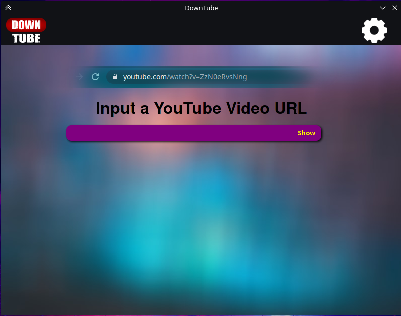
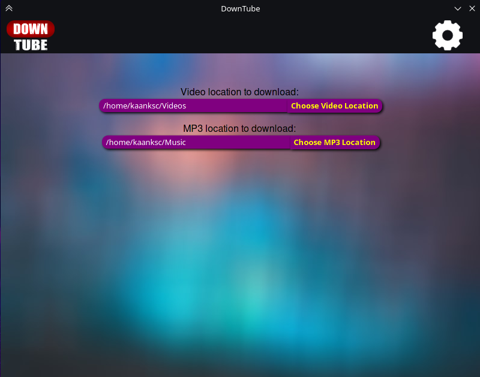
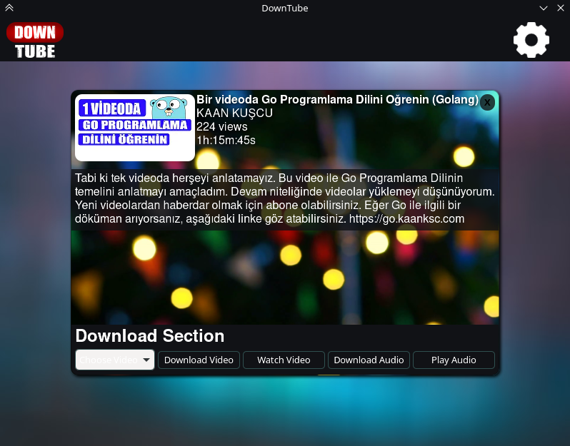

# DownTube
 Application of Download YouTube Videos and MP3s on GNU/Linux

 ## Dependencies for GNU/Linux
 - ffmpeg
 - webkit2gtk
 - youtube-dl

 ## For launching this App

 - **Normally:** Double Click to downtube-linux executable file
 - **Debug Mode:** `./downtube-linux` on terminal

 [Click for technical details](./technical-details.md)

 ## Screenshots

 
 
 
 
 
 
 

 